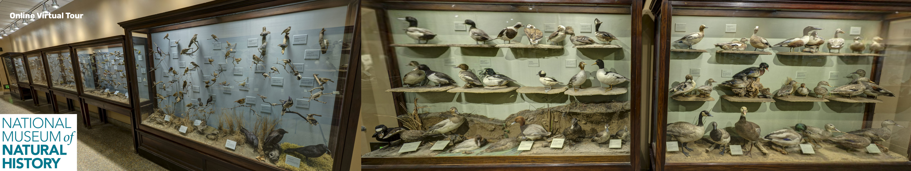
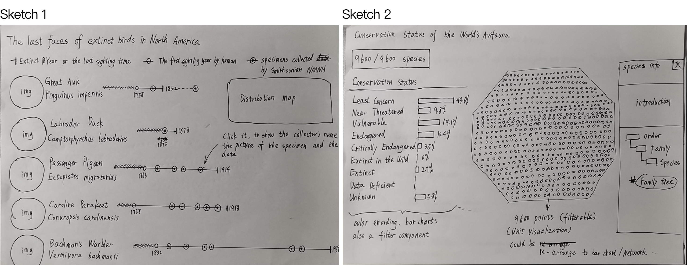
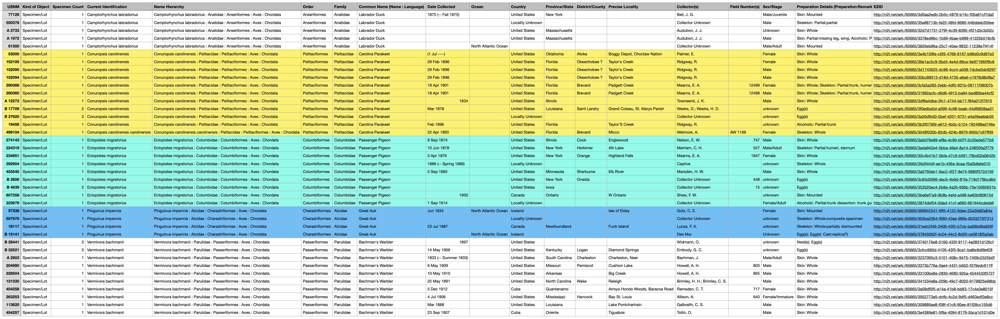

# Project 1: Visualize Quantitative Data
## Project Title
**Last Faces of Extinct Birds in North America**
*—— Scrutinizing the lifespans of extinct bird species*  
You can access the [video demo here](https://drive.google.com/file/d/10he8j2Y-nkIiiT9rWQodgpLHfQhFkddu/view?usp=sharing) and the [interactive prototype here](https://www.figma.com/proto/Ew2tDcc3rdeNUJPzOaTEnr/Major-Studio-1-Project-1?node-id=1%3A2&viewport=798%2C473%2C0.10880535840988159&scaling=scale-down-width).

## Initial motivation
1. To digitize the bird specimen collections in museum, bringing them to the stage. And taking advantage of the web technology to enable more people to see the appearance of those extinct birds.
2. To draw people's attention and to evoke responses on the issue of birds’ habitat destruction caused by human activities.

## Questions

Museums always display animal specimen collections, such as bird specimens, on the wall in a matrix-like way, no matter far at National Museums of Kenya or nearly at the National Museum of Natural History of Smithsonian. In on-site settings, those layouts give people a special sense of rhythm and beauty. However, if we're talking about collection digitization, we may be able to do something more. Taking pictures and make them accessible online is still a replication of the traditional on-site exhibition, which has not taken advantage of the digital interfaces.
So questions:
1. How to incorporate multiple dimensions of Information on the basis of displaying specimens.
2. How to engage people to discover, explore the collections and get the information they want while our design goals is being achieved.

## Process
### Ideation Alternatives

**The first idea** is to make an array, an on-site similar way, of timelines to show the extinct birds. People could know the first sighting time and extinct time of each bird and explore the specimens information, including collectors, images and collected years, collected by the Bird Division in National Museum of Natural History, Smithsonian.  

**The second one** is a unit visualization in which every unit(data point) represents one species of birds. All points are color encoded and could be filtered by conservation status and could be re-arranged in different views, for example, be transferred into a bar chart or a relationship network, to observe the data in various representations.

### Design Iteration

## Data sources
### The [Searchable Collection Database](https://collections.nmnh.si.edu/search/birds/) of The Division of Birds, National Museum of Natural History, Smithsonian Institute
The Division of Birds houses and maintains the third largest bird collection in the world with over 640,000 specimens. Its National Collection has representatives of about 85% of the approximately 10,000 known species in the world's avifauna.

On the database website, there are a few Quick Browse Searches, where we can see [Selected specimens of extinct North American birds](https://collections.nmnh.si.edu/search/birds/?v=l1). And we can easily export selected results as SVG (Shown as above). However, in this selected dataset, there are only five species. According to The IUCN Red List, there are 159 extinct (EX) species and 19 possibly extinct bird subspecies or status unknown. So it's necessary to introduce external datasets, the list of extinct bird. And then we could use the bird name in the list to query in NMNH database.

### External Datasets: List of extinct bird
[List of extinct bird species since 1500](https://en.wikipedia.org/wiki/List_of_extinct_bird_species_since_1500#cite_ref-4)    
[Category: Extinct birds of North America, Wikipedia](https://en.wikipedia.org/wiki/Category:Extinct_birds_of_North_America)

## Next steps or Future work
1. **Topic Extension** This project aims to empathize the extinct birds, but what's gone is gone, we need to pay attention to those still exist, to protect them. So the extension topic of my project would be Conservation Status. The [International Union for Conservation of Nature (IUCN)](https://en.wikipedia.org/wiki/International_Union_for_Conservation_of_Nature) lists avian species in different Conservation Status. As of December 2019, IUCN lists 225 critically endangered avian species, 461 endangered avian species, 800 vulnerable avian species. I think it's meaningful to visualize the [Conservation Status](https://en.wikipedia.org/wiki/Conservation_status) of current avian species to draw people's attention and to evoke responses. This idea has already been depicted in Ideation 2.  

> The IUCN Red List of Threatened Species is the best known worldwide conservation status listing and ranking system. Species are classified by the IUCN Red List into nine groups set through criteria such as rate of decline, population size, area of geographic distribution, and degree of population and distribution fragmentation. Also included are species that have gone extinct since 1500 CE. When discussing the IUCN Red List, the official term "threatened" is a grouping of three categories: critically endangered, endangered, and vulnerable.
> * Extinct (EX) – No known living individuals
> * Extinct in the wild (EW) – Known only to survive in captivity, or as a naturalized population outside its historic range
> * Critically endangered (CR) – Extremely high risk of extinction in the wild
> * Endangered (EN) – High risk of extinction in the wild
> * Vulnerable (VU) – High risk of endangerment in the wild
> * Near threatened (NT) – Likely to become endangered in the near future
> * Least concern (LC) – Lowest risk; does not qualify for a higher risk category. Widespread and abundant taxa are included in this category.
> * Data deficient (DD) – Not enough data to make an assessment of its risk of extinction
> * Not evaluated (NE) – Has not yet been evaluated against the criteria.

2. **Showcase Effects and Interaction Design** To make the virtual specimens more vivid, which means the experience of seeing the specimens could be more lifelike. This issue could be solved by 3D display, which is a mature web technology. However, I think this is relying on the potential future work of Smithsonian.
