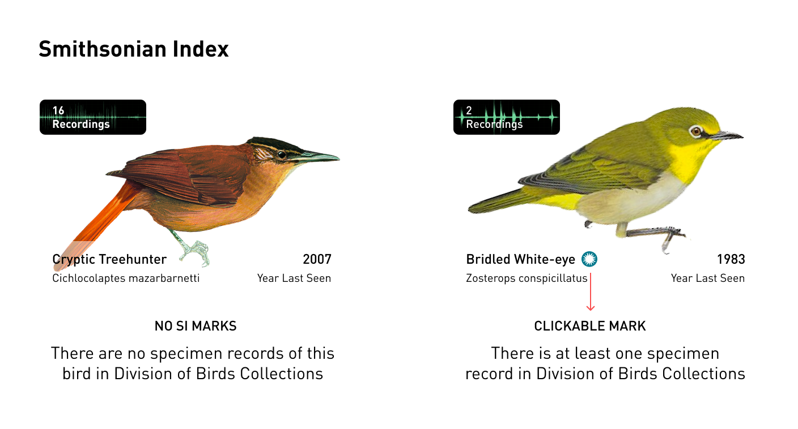

# Project 2: Visualize Qualitative Data
## A Symphony Beyond Reach: the Bird Swansongs

## Question
Generally, people are much more familiar with the appearance of a bird than its voice. Besides showing the pictures of a bird, we could do something more to enable people to have multilevel understandings of birds or avian species, especially those who are threatened, to raise awareness of the plight of species and the larger environmental issues surrounding them. So my questions here are:

1. how could we bring the voice of a bird into the stage.
2. how could we involve people in a voyage of exploration and discovery, so that they can DIY to make their own take-away experience.

## Design Process
### Ideation

**Oct 13 Sketch**


This is a continuation of [project 1](https://github.com/gitacoco/major_studio_1/tree/master/P1_Quantitative_datavis) that brings appearances of extinct birds for people. 

In this project, I am going to bring the voices of the threatened birds as well as few extinct ones' (I am lucky to find some precious songs of the birds extinct in recent years). When we think of multiple pictures we may combine them in canvas, like [Collage Art](https://en.wikipedia.org/wiki/Collage). And normally, people appreciate a painting by watching rather than listening since there is no sound. But if we associate each bird's picture with its songs, we enable people to make up a whole picture with bird voices and make it as a concerto to be heard.

The data visualization and sonification will meet here for people to generate their **data experience**.

### Prototype

**Oct 20 Prototype**

[](https://www.youtube.com/watch?v=2HPtaNh0Wno)

## Implementation Process
### Data Preparation
#### Databases and API

1. [The IUCN Red List](https://www.iucnredlist.org)

The IUCN Red List of Threatened Species is the best known worldwide conservation status listing and ranking system. We could output the data from their advanced search by filtering the **Taxonomy** (Animalia *Kingdom*, Chordata *Phylum*, Aves *Class*) and **Red List Category(conservation status)**. Here I tentatively choose three categories of EX, EW and CR.


Also，the Red List provides[API query](https://apiv3.iucnredlist.org/api/v3/docs#species-category). I have applied their TOKEN, and my request is still under review. 

```Javascript
//To get a list of species by category:
/api/v3/species/category/:category?token='YOUR TOKEN'
//Example: All VU (vulnerable) listed species
{
  "count": 14564,
  "category": "vu",
  "result": 
  [
    {
      "taxonid": 36563,
      "scientific_name": "Abarema abbottii",
      "subspecies": null,
      "rank": null,
      "subpopulation": null
    },
    …
  ]
}

```

2. [xeno-canto](https://www.xeno-canto.org/)

xeno-canto is a website for sharing recordings of sounds of wild birds from all across the world. Xeno-canto has plentiful voice recordings of birds. We could query it [API](https://www.xeno-canto.org/explore/api) by a Scientific name or Common name of a bird and get the response of recodings and their sono in JSON format, which could be got from The IUCN Red List's API.
```JS
//An example of recording object(excerpts)
 {
    "gen": "Troglodytes", //the generic name of the species
    "en": "Eurasian Wren", //the English name of the species
    "rec": "\u00c9tienne Leroy", //the name of the recordist
    "type": "song", //the sound type of the recording (e.g. 'call', 'song', etc)
    "file": "\/\/www.xeno-canto.org\/477551\/download", //the URL to the audio file
    "sono": {
        "small": "\/\/www.xeno-canto.org\/sounds\/uploaded\/ZWAQHOJFLZ\/ffts\/XC477551-small.png",
    }, //an object with the urls to the sonograms
```

3. The NMNH Birds Collection Database

The Division of Birds, National Museum of Natural History, Smithsonian Institution, houses and maintains the third largest bird collection in the world with over 625,000 specimens. We could use this database to match the candidates in our list: if NMNH has corresponding specimen records, the candidate will be marked a clickable logo:



To create a link to specific records at NMNH provide a querystring for: https://collections.nmnh.si.edu/search/birds/?QUERYSTRING

where QUERYSTRING is (use a plus-sign to separate case-insensitive terms):
The NAME of a TYPE specimen, e.g.:
`birds/?qt=otus+asio+maxwelliae`
`birds/?qt=sialia+mexicana`

2. Selection of Birds


## Reference
1. [How Bird Classification Works](http://birding-world.com/bird-classification-works/)
2. [Drag/Resize/Rotate Javascript](https://github.com/nichollascarter/subjx)