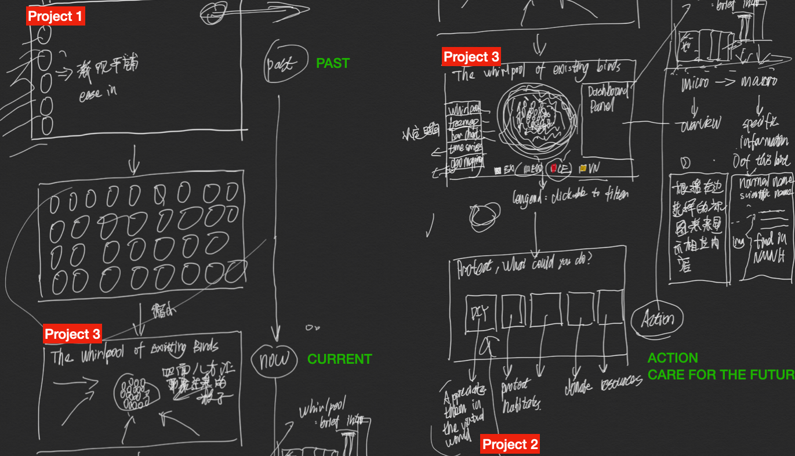

# Project 2: Visualize Qualitative Data
## An Growing Whirlpool of Threatened Avian Species

## Questions
My first project aims to display the extinct birds, but what's gone is gone, we need to pay attention to those still exist, and to protect them. So this project would focus on the Conservation Status of the existing birds.

Revolving around the conservation status, how to reveal the data in multiple dimensions? That is, how to tell a story of the status change over time, how to support comparison among different "threatened" categories, how to geocode each data point and show the relations between "threatened" species and geographical locations, how to display the taxonomy hierarchy of a specific bird, and how to show detailed information for objects just to the suitable level or scale. And how to integrate all these tasks into a consistent interface.

## Design 

### Ideation


### Prototype

## Datasets
1. [The IUCN Red List](https://www.iucnredlist.org)
The IUCN Red List of Threatened Species is the best known worldwide conservation status listing and ranking system. 

- Data Points
IUCN lists avian species in different Conservation Status. As of December 2019, IUCN lists 225 critically endangered avian species, 461 endangered avian species, 800 vulnerable avian species. 

- Sample Properties 
```CSS
{
  Normal Name: Hawaiian Crow
  Scientific Name: Corvus hawaiiensis
  Category: Extinct in the Wild
  Taxonomy: {
          KINGDOM: Animalia
          PHYLUM: Chordata
          CLASS: Aves
          ORDER: Passeriformes
          FAMILY: Corvidae
          GENUS: Corvus
        }
  Year Last Seen: 2002
  Geographic Range: Polygons (SHP)
  Historical Assessments:{
          2004 — Extinct in the Wild (EW)
          1994 — Critically Endangered (CR)
          1988 — Threatened (T)
        }
  System: Terrestrial
  Habitat Type: Forest, Shrubland, Artificial/Terrestrial
  Threats: {
          Agriculture & aquaculture
          Biological resource use
          Human intrusions & disturbance
          Invasive and other problematic species, genes & diseases
  }
}
```
- Data Quality
Very good and complete datasets with a long maintenance history.

2. [The NMNH Birds Collection Database](https://collections.nmnh.si.edu/search/birds/)
- Data Points
The Division of Birds, National Museum of Natural History, Smithsonian Institution, houses and maintains the third largest bird collection in the world with over 625,000 specimens.

- Properties
```CSS
Specimen/Lot
{
  Catalog Number:	USNM 177995
  Normal Name: Hawaiian Crow
  Scientific Name: Corvus hawaiiensis
  Sex: Male
  Stage: Adult
  Date Collected:	12 Jun 1899
  Collector(s):	Henshaw, H. W.
  EZID:	http://n2t.net/ark:/65665/347586eff-5a1d-4437-8a91-26de3576fdca
}
```

- Data Quality
  - Not every bird could be matched in this database. 
  - Most of the specimens are not uploaded to this online database, meaning many recordings are without a pic.

## Why Interactive
In this project, we have multiple tasks and data views, so we need interaction to:
1. Preclude showing everything at once, supporting investigation at multiple levels of detail;
2. Support different queries by changing displays, representing the data in different ways for understanding the connections between these alternatives;
3. Change the view when user actions taken, forming a narrative following the user's reading flow;

## Visualization Method
1. Spatio-temporal data visualization
2. Graph Visualization
3. Unit Visualization

## Reference
1. D. Park, S. M. Drucker, R. Fernandez and N. Elmqvist, "Atom: A Grammar for Unit Visualizations," in IEEE Transactions on Visualization and Computer Graphics, vol. 24, no. 12, pp. 3032-3043, 1 Dec. 2018, doi: 10.1109/TVCG.2017.2785807.
2. Heer, Jeffrey, and George Robertson. "Animated transitions in statistical data graphics." IEEE transactions on visualization and computer graphics 13.6 (2007): 1240-1247.
3. Munzner, Tamara. Visualization analysis and design. CRC press, 2014.