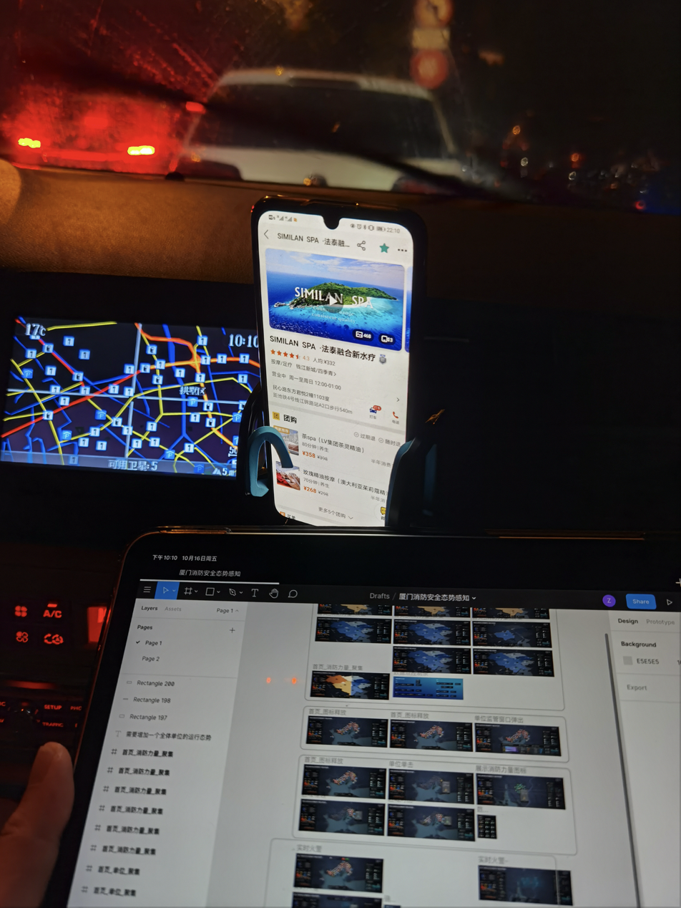

# Prototyping and Interactions in Figma 

## What is Figma and Why I like it (Compared to Sketch)

> Figma is a could-based collaborative interface design tool that compatible with any operating system. 

And the most importantly, it’s free for individual designers. Following are my favorite 6 features of Figma:

1. **Version Control**

In programming, we use Git to records changes to a file over time so that we can recall specific versions later.  And traditionally, for UI design software we would manage our file like this way: 

But in Figma, that would be a different story. And you never need to struggle with losing and juggling files. 

2. **High-Performance Computing**

Usually, when we have too many (actually not too many) layers or elementals, the software tends to stutter or get lags. They would be too slow and don’t response in time. But Figma is cloud-based. It is a SaaS platform, like Gmail and Google Docs. So the computing process is in the cloud, and have a high performance.

4. **High-efficiency Editing**

Figma has lots of features to support Bulk Manipulation (such as color modification, rename) and Quick Select. Take **color modification** as an example, in Sketch, especially in nested layers, If we want to change color of a specific element, we need to click again and again to enter the target layer. But in Figma, this would not happen. 

5. **Compatibility**

Whatever in Windows, Mac OS & Linux, as long as you can run web browsers, you can run Figma. And Figma also has a client application that supports offline editing. And there even is a third-party application in iPadOS called [Figurative](https://figurative.design), supporting Apple Pencil and touch gestures. 
I once used it when I was away from home.

6. **An Accelerator for your Design**: UI Kits, Design Systems, Wireframes and Plugins in Community

Sometimes, you need to deliver a hi-fi prototype rapidly for your client. Even if it's still in the early stage of the project. Many clients just have no clear idea of the outcome and their needs. They wish you can show something first. So the case here is that you could make it with the help of UI kits in Figma Community. For example, recently I was designing a firefighting situational awareness system for Xiamen City in China, which is for large-screen environments.  And there was a day my client just had a brainwave that they want an edition for cellphone. This is not a formal requirement, so I used UI kits in Figma to build a hi-fi mockup in 4 hours. (This is the only project I used UI kit. I never used them for Major Studio Projects!)

7. **Besides Above**

Figma has tons of useful features such as **Auto Layout**, **Components(Equivalent to **Symbol** in Sketch)**, **Design System** and **Collaboration and Share and Present**. If you are interested in these features, you can visit [Courses Resources Section](https://www.figma.com/resources/courses/).

## Prototyping with Figma

In Figma, you can design, prototype and present, all in the same tool. You prototype while you design, and design while you prototype. 

I summarized three main steps for prototyping with Figma:

### Step 1: Connecting Frames 

The nature:
changes/animation = transformations across frames

identical area between two pages = visually static
difference between two pages = changes/animation

* from linear to non-linear

### Step 2: Setting the Interaction (Transformation Trigger)

Most commonly used(for me):
- **On Click**
    - Case 1: Bird Project 2 (Expand a category of bird list)

- **While Hovering**
    - Case 2: Bird Project 2 (Bird Selection)
    - Case 3: Reading Presentation (Charts Comparison)

Low-frequency used(for me):
- **After Delay**
    - Case 4: Bird Project 2 (Environment Detection)
    - Case 5: Xiamen Vis (A New Fire Event)
- **Drag**
    - Case 6: Xiamen Vis Mobile Client (Panel)

### Step 3: Setting the Animation (Transition)

Most commonly used(for me):
- **Dissolve**
- **Instant**
- **Smart Animation**
    - Equivalent of Keynote Magic Move in Keynote or Inbetweening in Flash
    - Not only make up for the shape and size, but movement, rotation, color (gradient and transparency) and many other things

    - Case 7: Bird Project 2 (Control Bar)
        - Problem: a leak of the text

    Use tips:
    - The same layer name
    - Location in the layer hierarchy
    - Check by hovering

**Smart Animation** VS **Dissolve** or **Instant**

    - Tip: use **Smart Animation** with restraint
    - Case 1: Bird Project 2 (Expand a category of bird list)

### Sometimes: Overflow Behavior for Frames

- Frames in Figma

> If you've used design tools before, you'll be familiar with artboards. Like artboards, frames allow you to choose an area of the canvas to create your designs in. Unlike traditional artboards, you can also nest frames within other frames. This allows to create more complex design that work together.

- A Frame as a container
    - Case 7: Bird Project 2 (Control Bar)
    - Case 1: Bird Project 2 (Expand a category of bird list)
    - Case 6: Xiamen Vis Mobile Client (Unit List)
    - Clip content
- Affect child objects
    - Move
    - Resize
    - Set Horizontal and Vertical Constraint
    - Case 8: Bird Project 2 [SI Logo](./si-logo.svg)
    
- **Scrolling** VS **Push**
    - cost of making
    - the nuance of effect
        - Drag: magnetically forced, cross-Frame
        - Scrolling: seamless, stay-in-Frame
    - Case 6: Xiamen Vis Mobile Client (Panels)

### Extra strategy

- Hide defect when sharing
- Trade off: choosing the most handy tool
    - Case 9: Bird Project 2 ([Add sound files to prototype](https://www.youtube.com/watch?v=4sKflYAjEyA&feature=youtu.be))

### Limitations

- Dynamic Interaction Process
    - Case 10: Bird Project 2 (Cannot Drag Birds to the Canvas)

The prototype function in Figma is not as powerful as some tools specialized for prototyping, but it meets most of my needs and it has its exclusive advantage: straightforward and seamless with design process.
